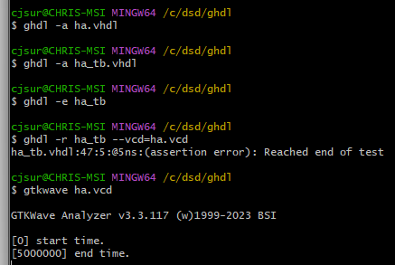
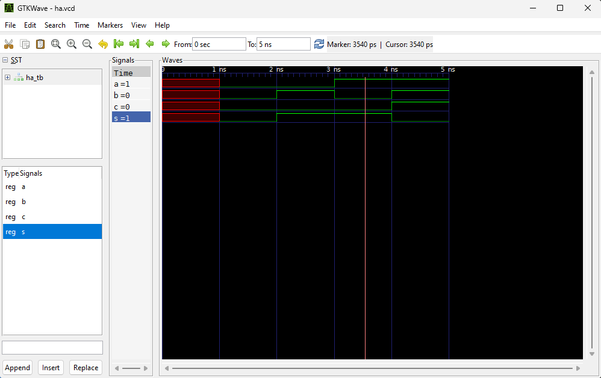
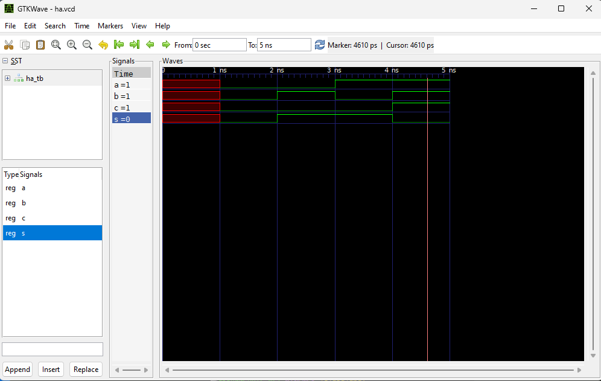

# Lab 1 -- GHDL and GTKWave Practice
**Using vhdl entity and testbenches, make use of both GHDL and GTKWave as a wave visualizer.**

### Half Adder
You begin by usign GHDL to analyze the two files, a testbench and a top entity of the half adder, and eventually execute the testbench.
After gathering the outputs as a function of time, we can run the GTKWave file.

A half adder should sum two bit values: `a` and `b` here.
The results will go into the sum, or the carry bit, represented by `s` and `c`, respectively.

Below `a=0` and `b=0` so both `s=0` and `c=0`:

Below `a=0` and `b=1` so both `s=1` and `c=0`

Below `a=1` and `b=0` so both `s=1` and `c=0`

Below `a=1` and `b=1` so both `s=0` and `c=1`

This represents the four states that the half-adder system can have!
This system is asynchronous from any clock and responds immediately to internal change.

### D-Flip Flop
You begin by usign GHDL to analyze the two files, a testbench and a top entity of the D-Flip FLop, and eventually execute the testbench.
After gathering the outputs as a function of time, we can run the GTKWave file.

The premise of a D-Flip Flop is to take input on the Data_In line, and whatever is present on the rising edge of the 

